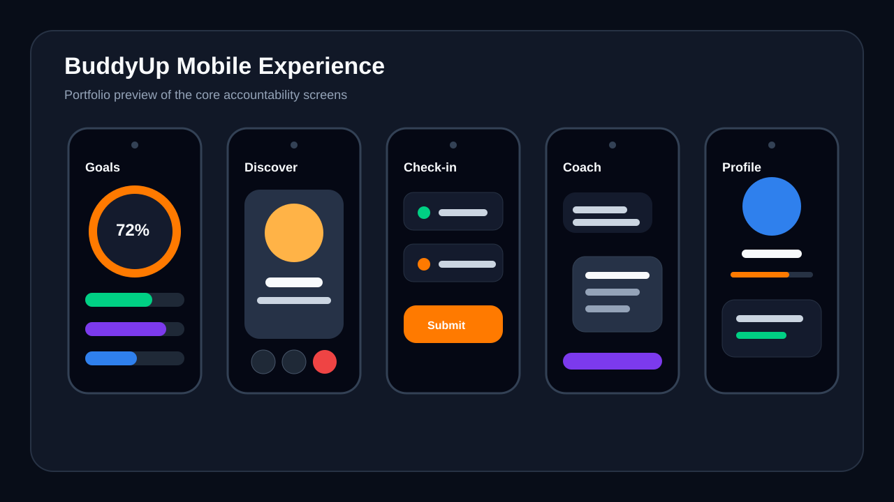
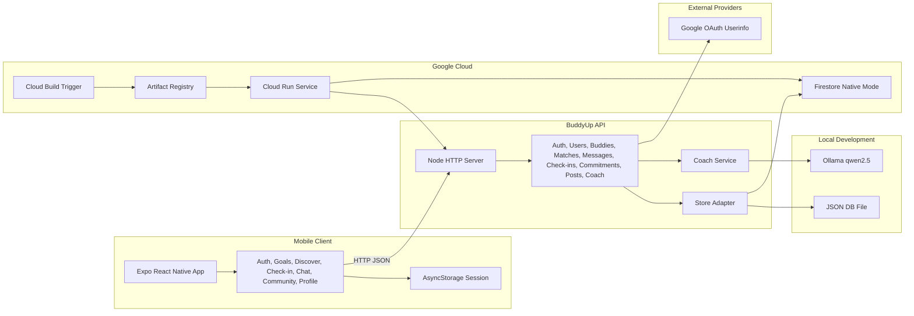
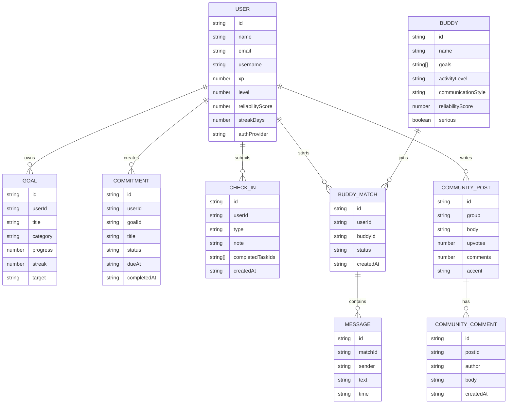
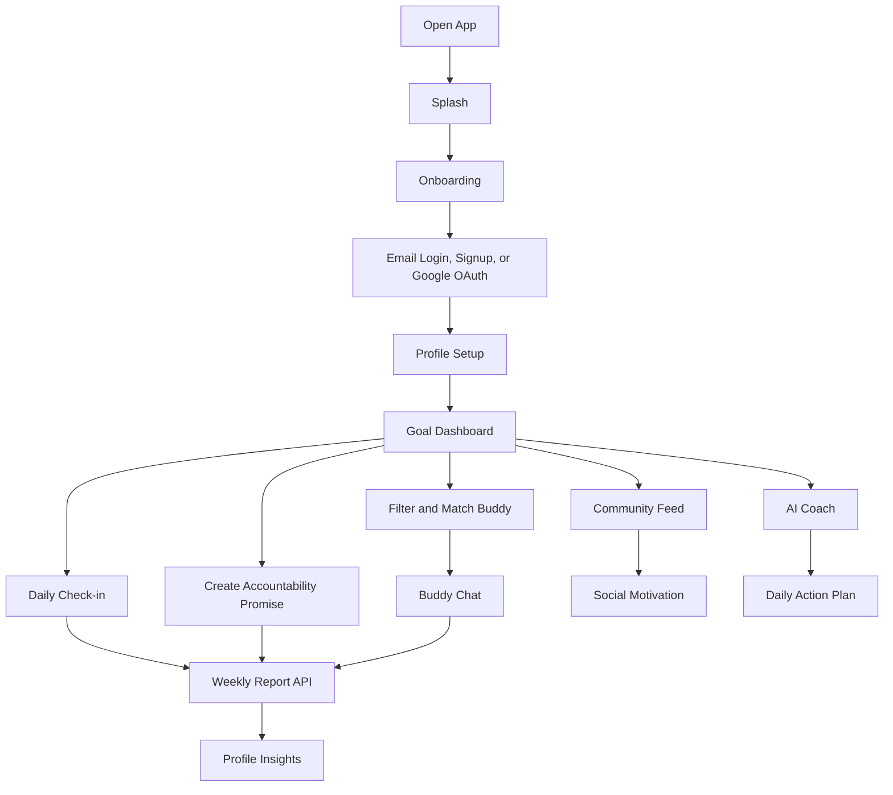
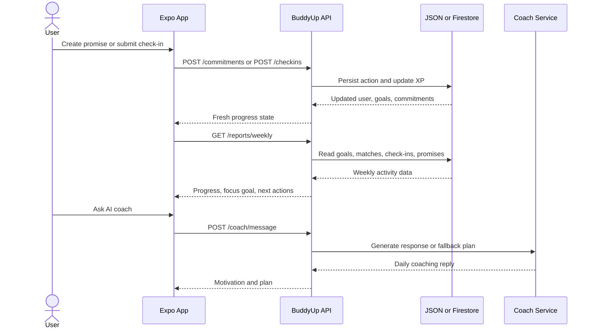
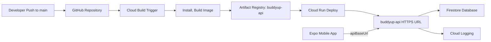

# BuddyUp

BuddyUp is a React Native + Expo mobile app for accountability partnerships. It helps users create goals, match with serious partners, check in daily, chat with buddies, post progress in communities, and receive AI coaching through a Node API that can run locally or on Google Cloud Run.

This repository is structured as a portfolio project: it includes a mobile app, a backend API, local JSON persistence, Firestore-ready deployment mode, CI/CD configuration, Google OAuth wiring, and Ollama-backed coaching fallback logic.

## Screen Preview



This generated preview summarizes the main app screens: goals, discovery, check-in, AI coach, and profile insights. The live implementation is in `src/screens/`.

## Project Snapshot

| Area | Implementation |
| --- | --- |
| Mobile app | Expo SDK 54, React Native, TypeScript |
| Backend | Node.js HTTP API with test coverage |
| Local storage | JSON file store for quick PC and emulator testing |
| Cloud storage | Firestore mode for Google Cloud Run deployment |
| Auth | Email/password plus real Google OAuth token verification path |
| AI coach | Ollama on local PC, rule-based fallback in hosted mode |
| CI/CD | Cloud Build trigger, Artifact Registry, Cloud Run deployment |
| Quality gates | Node test runner and TypeScript typecheck |

## Core Features

- Onboarding, signup, login, Google OAuth handoff, and profile setup
- Goal dashboard with streaks, progress, promises, community shortcut, and AI coach shortcut
- Goal dashboard promise summary with open, closed, and total counts
- Goal-filtered buddy discovery backed by the API with visible result counts and filter reset
- Daily check-ins with task completion counts, notes, XP, streak, and reliability updates
- Buddy matching with user validation, starter chat messages, validated chat sends, and quick accountability prompts
- Community feed with interactive For You, Following, and Groups tabs plus posts, comments, upvotes, and input validation
- AI coach daily plan, quick prompts, validated message endpoint, and Ollama support
- Profile insights backed by the weekly report API, including report week and promise completion rate
- Backend health visibility inside the mobile profile screen

## Architecture



The same API surface is used for local testing and Cloud Run. The `DATA_STORE` environment variable selects JSON or Firestore, while `OLLAMA_ENABLED` controls whether hosted deployments use local AI calls or the rule-based fallback.

## Database Model



The local JSON database uses these collections directly. Firestore mode stores the same top-level collections so local and hosted behavior stay aligned during testing.

## Product Flow



## Accountability Loop



These flows show the main portfolio story: users make commitments, prove progress, receive feedback, and use buddies or AI coaching to keep momentum.

## Deployment Pipeline



The deployed backend currently uses Cloud Run for the API container and Firestore for persistent hosted data. Local emulator and iPhone testing can still point to the PC server by leaving `expo.extra.apiBaseUrl` empty or setting it to the LAN address printed by `npm run server`.

## Runtime Modes

| Mode | API URL | Data store | AI coach |
| --- | --- | --- | --- |
| Local web | `http://localhost:4000` | JSON file | Ollama if running |
| Android emulator | `http://<expo-host>:4000` or `http://10.0.2.2:4000` | JSON file | Ollama if reachable |
| iPhone on LAN | `http://<pc-lan-ip>:4000` | JSON file | Ollama on PC |
| Cloud Run | Cloud Run HTTPS URL | Firestore | Rule fallback unless hosted AI is configured |

## Run Locally

```bash
npm install
npm run server
```

In a second terminal:

```bash
npm run web
```

For iPhone/Android Expo Go testing, run:

```bash
npm start -- --clear
```

Run tests:

```bash
npm test
npm run typecheck
```

For a guided phone/emulator pass, use [docs/mobile-testing-checklist.md](docs/mobile-testing-checklist.md).

## API Notes

The Expo app reads `expo.extra.apiBaseUrl` from `app.json`. If that is empty during local development, it uses the Expo dev host and talks to your PC on port `4000`, which is what phones and Android emulators need.

Useful endpoints while testing:

- `GET /health` returns API metadata, version, store type, and current server time.
- `GET /stats` returns aggregate users, goals, buddies, matches, check-ins, promises, and community activity.
- `GET /buddies?seriousOnly=true&goal=Coding` returns filtered buddy suggestions.
- `POST /commitments` creates an accountability promise.
- `PATCH /commitments/:id/complete` closes a promise and awards accountability credit.
- `DELETE /commitments/:id` removes a promise that no longer applies.
- `GET /reports/weekly?userId=...` powers the weekly insight card on the profile screen.
- `POST /matches` validates both the app user and buddy before creating a match.
- `POST /coach/message` rejects blank prompts before attempting Ollama or fallback coaching.

The API rejects invalid profile setup fields, unknown match users, unknown check-in users, unsupported check-in media types, empty coach prompts, empty chat messages, and blank community posts or comments. Those checks are mirrored in the mobile UI where practical.

Recent mobile polish:

- The Goals screen summarizes promise progress before the user opens Profile.
- The Discover screen shows how many buddies match the current filter and offers a reset action for empty results.
- The Check-in screen shows how many goals are selected before submitting progress.
- The Community screen tabs now filter feed views for faster mobile scanning.
- The Chat screen includes quick accountability prompts for common buddy updates.
- The AI Coach screen includes quick prompt chips for plans, stuck moments, and motivation.
- The weekly report now returns open promises and promise completion rate for stronger profile insights.

## Google Sign-In

Google sign-in is wired as a real OAuth browser flow. To enable it:

1. Create OAuth client IDs in Google Cloud Console for iOS, Android, and/or Web.
2. Add them to `app.json` under `expo.extra`:

```json
{
  "googleExpoClientId": "",
  "googleIosClientId": "",
  "googleAndroidClientId": "",
  "googleWebClientId": ""
}
```

3. Restart Expo with:

```bash
npm start -- --clear
```

The app sends the Google access token to the local API, and the API verifies it through Google's userinfo endpoint before creating or connecting the account.

## Ollama AI Coach

The AI Coach first tries Ollama on your PC:

```bash
ollama run qwen2.5
```

In a separate terminal:

```bash
$env:OLLAMA_MODEL="qwen2.5"
npm run server
```

If Ollama is not running, the API falls back to local rule-based coaching so the app remains usable.

## Firebase

Add the Firebase project config values to `app.json` under `expo.extra`, then wire the screens to `auth`, `db`, and `storage` from `src/services/firebase.ts`.
