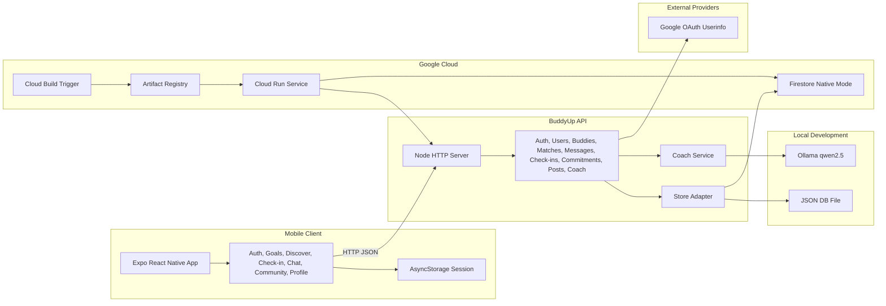

# BuddyUp

BuddyUp is a React Native + Expo mobile app for accountability partnerships. It helps users create goals, match with serious partners, check in daily, chat with buddies, post progress in communities, and receive AI coaching through a Node API that can run locally or on Google Cloud Run.

This repository is structured as a portfolio project: it includes a mobile app, a backend API, local JSON persistence, Firestore-ready deployment mode, CI/CD configuration, Google OAuth wiring, and Ollama-backed coaching fallback logic.

## Project Snapshot

| Area | Implementation |
| --- | --- |
| Mobile app | Expo SDK 54, React Native, TypeScript |
| Backend | Node.js HTTP API with test coverage |
| Local storage | JSON file store for quick PC and emulator testing |
| Cloud storage | Firestore mode for Google Cloud Run deployment |
| Auth | Email/password plus real Google OAuth token verification path |
| AI coach | Ollama on local PC, rule-based fallback in hosted mode |
| CI/CD | Cloud Build trigger, Artifact Registry, Cloud Run deployment |
| Quality gates | Node test runner and TypeScript typecheck |

## Core Features

- Onboarding, signup, login, Google OAuth handoff, and profile setup
- Goal dashboard with streaks, progress, promises, community shortcut, and AI coach shortcut
- Goal-filtered buddy discovery backed by the API
- Daily check-ins with task completion, notes, XP, streak, and reliability updates
- Buddy matching, starter chat messages, and validated chat sends
- Community feed with posts, comments, upvotes, and input validation
- AI coach daily plan and message endpoint with Ollama support
- Profile insights backed by the weekly report API
- Backend health visibility inside the mobile profile screen

## Architecture



The same API surface is used for local testing and Cloud Run. The `DATA_STORE` environment variable selects JSON or Firestore, while `OLLAMA_ENABLED` controls whether hosted deployments use local AI calls or the rule-based fallback.

## Run Locally

```bash
npm install
npm run server
```

In a second terminal:

```bash
npm run web
```

For iPhone/Android Expo Go testing, run:

```bash
npm start -- --clear
```

Run tests:

```bash
npm test
npm run typecheck
```

## API Notes

The Expo app reads `expo.extra.apiBaseUrl` from `app.json`. If that is empty during local development, it uses the Expo dev host and talks to your PC on port `4000`, which is what phones and Android emulators need.

Useful endpoints while testing:

- `GET /health` returns API metadata, version, store type, and current server time.
- `GET /buddies?seriousOnly=true&goal=Coding` returns filtered buddy suggestions.
- `POST /commitments` creates an accountability promise.
- `PATCH /commitments/:id/complete` closes a promise and awards accountability credit.
- `DELETE /commitments/:id` removes a promise that no longer applies.
- `GET /reports/weekly?userId=...` powers the weekly insight card on the profile screen.

## Google Sign-In

Google sign-in is wired as a real OAuth browser flow. To enable it:

1. Create OAuth client IDs in Google Cloud Console for iOS, Android, and/or Web.
2. Add them to `app.json` under `expo.extra`:

```json
{
  "googleExpoClientId": "",
  "googleIosClientId": "",
  "googleAndroidClientId": "",
  "googleWebClientId": ""
}
```

3. Restart Expo with:

```bash
npm start -- --clear
```

The app sends the Google access token to the local API, and the API verifies it through Google's userinfo endpoint before creating or connecting the account.

## Ollama AI Coach

The AI Coach first tries Ollama on your PC:

```bash
ollama run qwen2.5
```

In a separate terminal:

```bash
$env:OLLAMA_MODEL="qwen2.5"
npm run server
```

If Ollama is not running, the API falls back to local rule-based coaching so the app remains usable.

## Firebase

Add the Firebase project config values to `app.json` under `expo.extra`, then wire the screens to `auth`, `db`, and `storage` from `src/services/firebase.ts`.
